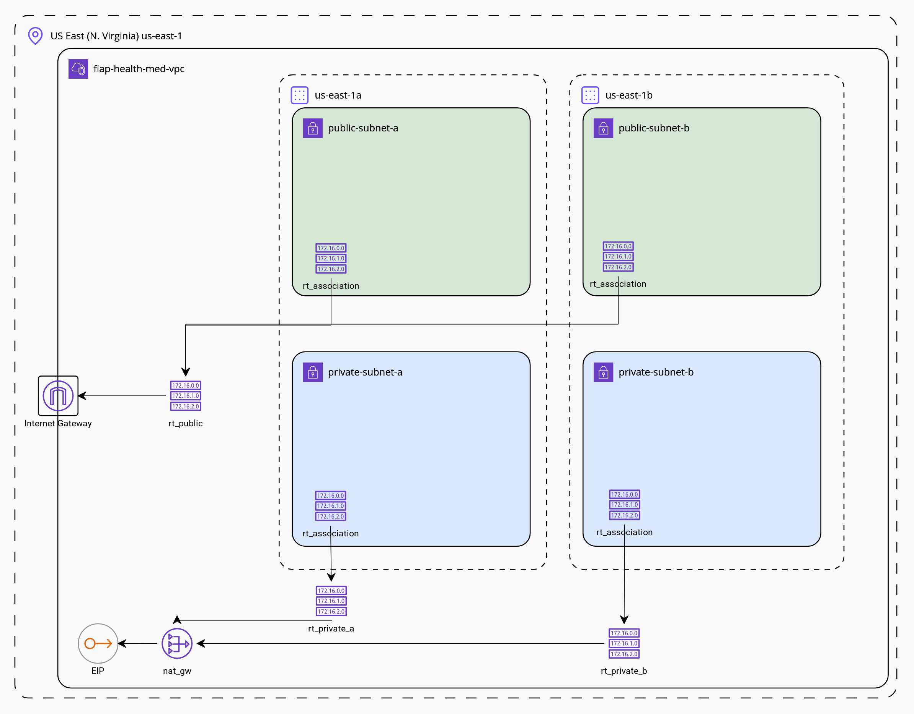
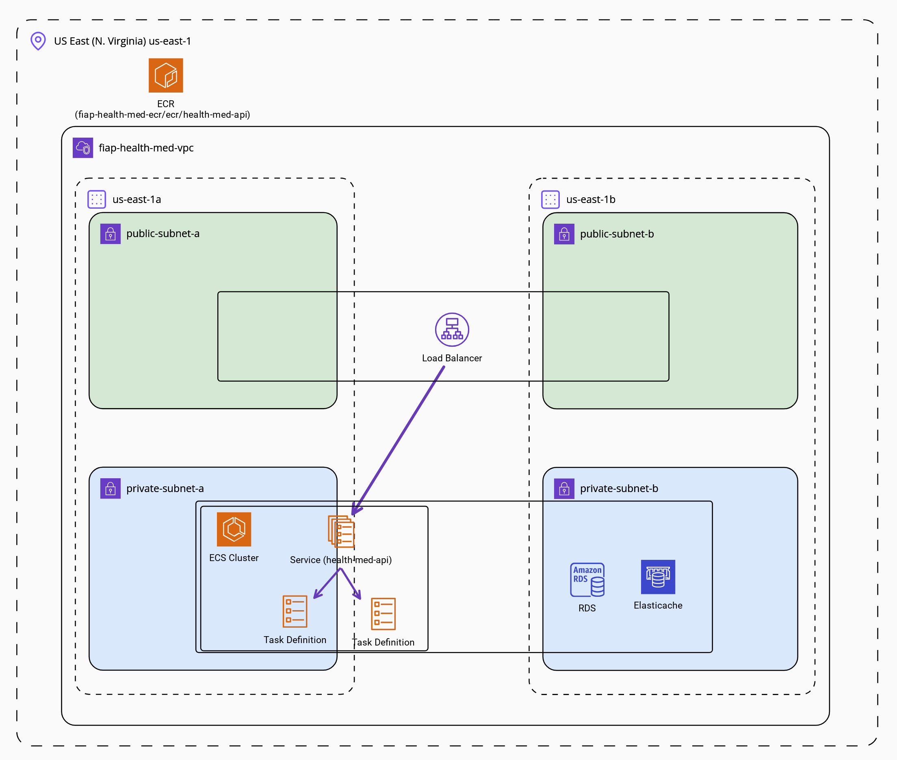

# Hackathon - Health&Med
This repository is a indexer of Health&Med project repositories. Proposed as final project for the Software Architecture Postgraduate course at FIAP built in Hackathon format.

## Repositories
| Repository | Content |
| :---:   | :---: |
| [health-med-infra](https://github.com/FIAP-5SOAT-G56/health-med-infra) | Terraform project to provisioning an infrastructure on AWS including VPC, Subnets, Security Groups, ECR, ECS, RDS, Redis, SNS and SQS. |
| [health-med-api](https://github.com/FIAP-5SOAT-G56/health-med-api) | Health&Med REST API (Backend) |
| [health-med-web](https://github.com/FIAP-5SOAT-G56/health-med-web) | Health&Med Web Application Project (Frontend) |
| [health-med-notifier](https://github.com/FIAP-5SOAT-G56/health-med-notifier) | Notification Service to send emails to our users |

## Archictecture Diagrams

### Network Architecture Diagram

### Application Architecture Diagram

### Notifier Architecture Diagram

### Concurrence Handling Diagram
